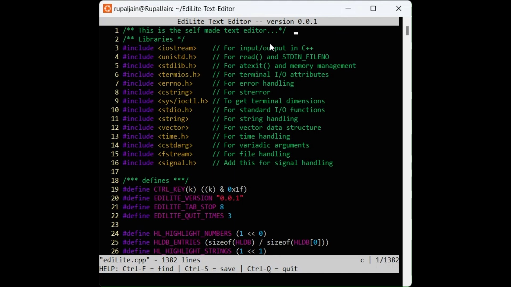
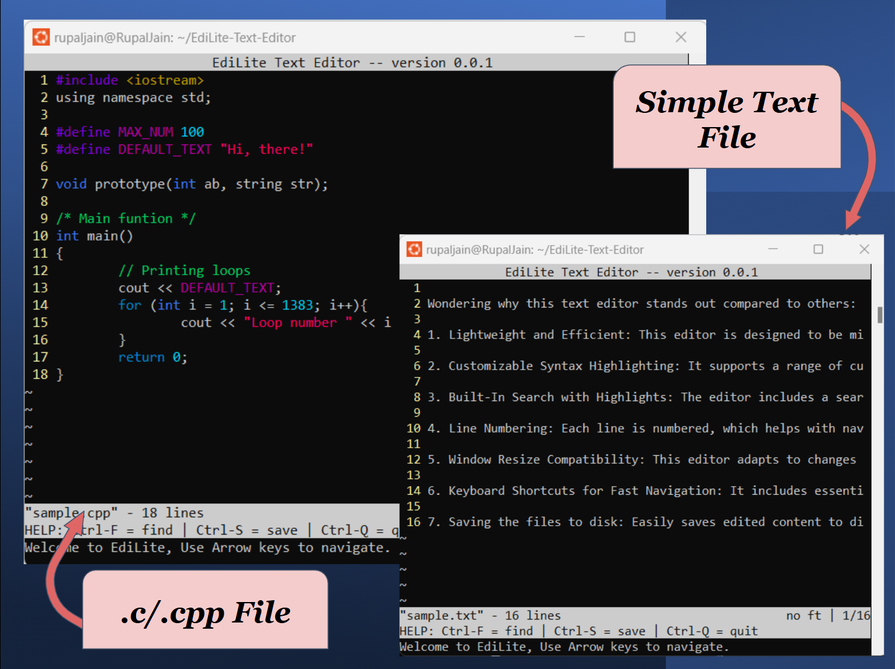

# EdiLite: Linux Text Editor

EdiLite is a lightweight terminal-based text editor implemented in C++. This editor supports essential editing features, including syntax highlighting, line-based navigation, and file saving.


<!-- [](https://youtu.be/1OCo7KOovRY) -->

## Walkthough the Editor:
**[](screenshots\text-editor.mp4)**

## Key Features

- **Basic Text Editing:** Supports essential editing operations, including character insertion, deletion, line insertion, and backspacing.
- **Real-Time Search:** Use Ctrl-F to search within a file, with navigation through matches.
- **Syntax Highlighting:** Highlights syntax elements like keywords, strings, numbers, and comments, with specific support for C/C++.
- **Navigation and Scrolling:** Full support for cursor navigation with arrow keys, page up/down, and home/end keys.
- **File Management:** Save files with Ctrl-S and view unsaved changes in the status bar.




## Steps-by-Step Features and Implementation

**1. Entering raw mode.**

Raw mode is a terminal setting that allows the program to read input directly from the user without buffering or processing (like echoing characters or interpreting special keys). This lets the editor respond immediately to each keypress for an interactive editing experience. Raw mode is achieved by:

- **Disabling echoing:** Prevents characters from being displayed automatically.
- **Disabling canonical mode:** Allows reading input byte-by-byte instead of line-by-line.
- **Turning off control combinations:** Captures keys like `Ctrl-C`, `Ctrl-Z`, `Ctrl-S`, `Ctrl-Q`, `Ctrl-V`, and `Ctrl-M` without triggering terminal signals.
- **Error handling:** Exits and print the error details if issues arise.

**2. Quit Command and Screen Clear**

Press `Ctrl-Q` to quit the editor. The editor clears the terminal screen on exit, with a confirmation prompt if there are unsaved changes.

**5. Cursor Management**

Cursor movements (left/right/up/down) and boundary handling are implemented with smooth transitions:

- Positions cursor correctly for typing, erasing, and navigation.
- Supports special keys: `PAGE UP`, `PAGE DOWN`, `HOME`, `END`, `DELETE`, `TAB`, `Backspace`, and `ENTER`.

**6. Fetching and Using Terminal Size**

The editor dynamically retrieves terminal dimensions and uses them to control line rendering. Lines start with a tilde (`~`) symbol to signify unused space.

**7. Mapping Keys and Control Combinations**

The editor maps keys and control sequences for intuitive navigation like `PAGE UP`, `PAGE DOWN`, `HOME`, `END`, `DELETE`, `TAB`, `Backspace`, `ENTER`, including arrow keys for vertical/horizontal scrolling and `Ctrl-S` for saving.

**8. Dynamic Text Rendering**

Rows are stored dynamically in an array, `E.row`, allowing for real-time additions, deletions, and updates without manual memory management.

**9. Supports Windows Resizing**

Automatically adjusts the content display when the terminal window is resized, ensuring that the editor remains fully viewable and responsive to the new dimensions. This feature prevents content overlap and maintains a consistent layout without the need for a manual refresh

**10. Line Numbering**

Displays line numbers alongside each line of text, enhancing navigation and code readability. This feature includes automatic alignment based on the total number of lines, ensuring line numbers are neatly displayed regardless of file length.

**11. Welcome Message and Status Bars**

New or existing files display a welcome message, along with a status bar showing the filename, line count, Help manual and modification status.

**12. File Saving and User Prompt**

The editor prompts for a filename on the first save (using `Ctrl-S`). If unsaved changes exist, a warning is displayed before quitting to prevent accidental data loss.

**13. Search Functionality**

Press `Ctrl-F` to initiate search mode. Navigate between matches using arrow keys, and exit search with `Enter` or `Escape`.

**14. Syntax Highlighting**

Detecting filetype to apply syntax highlighting. Supports coloring of elements like:

- Numbers
- Strings
- Keywords (specific to C/C++)
- Comments
- Search Matches: Search results are highlighted to aid quick identification.

**15. Organized Code Structure**

The code is structured into clear sections to handle different functionalities:

- **Data and Definitions:** Stores constants, structures, and enums.
- **Terminal Handling:** Manages raw mode and terminal attributes.
- **Input and Output:** Reads keys and displays content.
- **File I/O:** Supports loading and saving files.
- **Editor Operations:** Handles core editing tasks.
- **Row Operations:** Manages text rows and line-based manipulations.
- **Syntax Highlighting:** Implements syntax-specific coloring for better readability.
- **Search:** Allows finding text with forward/backward navigation.
- **Initialization:** Sets up the editor's environment.

## Installation

To compile and run the EdiLite editor:

1. Clone or download the source code.

2. Open a terminal and navigate to the source directory.

3. Compile the code using:

```
g++ -o EdiLite EdiLite.cpp -Wall
```

4. Run the editor with:

```
./EdiLite <filename>
```

If no filename is provided, a new file will be created upon saving.

**\*Note:** Developed and tested on Ubuntu.\*

## Usage

- **Save:** `Ctrl-S`
- **Quit:** `Ctrl-Q` (requires confirmation if unsaved changes exist)
- **Search:** `Ctrl-F` (use arrow keys to navigate results)
- **Navigation:** Arrow keys, `Page Up`, `Page Down`, `Home`, `End`
- **Syntax Highlighting:** Automatically applied for C/C++ files based on file extension

### Additional Information

EdiLite’s syntax highlighting adapts automatically based on file type, using standard rules for C/C++ elements. Other file types are loaded without syntax-specific coloring.

## Code Length

1383 lines of code
